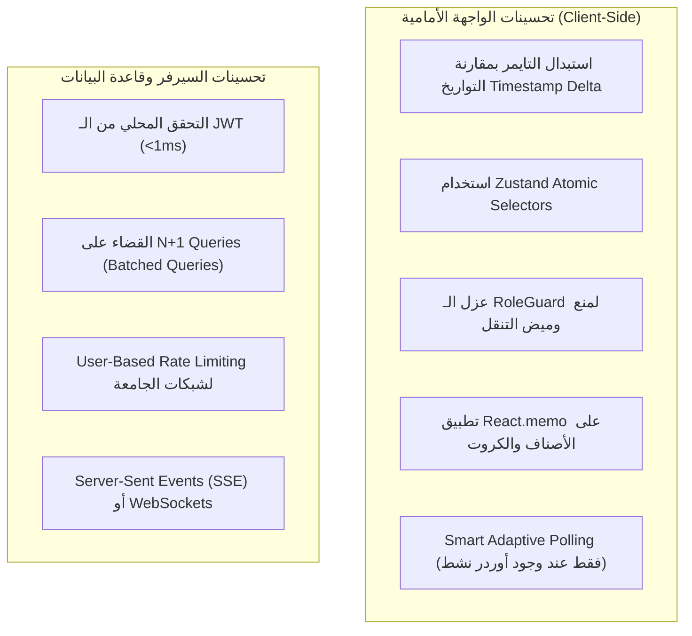

# 🚀 تقرير الفحص الفني الشامل: تحليل الأداء، استقرار الريكوستات، ثقل الفرونت إند، وقابلية التوسع لـ 10,000+ طالب

---

## 📌 1. الملخص التنفيذي (Executive Summary)

تم إعداد هذا التقرير الفني بعد فحص معمق وشامل لكود مشروع **OrderFAST** عبر جميع طبقاته:
* **الواجهة الأمامية (Frontend):** Next.js (App Router) + Zustand + TailwindCSS
* **الخلفية (Backend API):** Fastify + Drizzle ORM + PostgreSQL + Supabase Auth
* **قاعدة البيانات (Database):** PostgreSQL على Supabase (مع Transaction Pooler & Indexes)

### النتيجة الأساسية:
المشروع مبني بهيكلية برمجية متماسكة وتعمل بنجاح على المستوى الوظيفي (Functional Features). ومع ذلك، هناك سببان رئيسيان للبطء:
1. **اختناقات في الـ Backend وقاعدة البيانات:** ناتجة عن التحقق الخارجي من الـ Auth في كل ريكوست، واستعلامات الـ N+1 Queries، والـ Polling المكثف.
2. **ثقل داخلي في الـ Frontend نفسه (Client-Side Lag):** ناتج عن إعادة التصيير (Re-renders) المتكررة كل ثانية، غياب الـ Selectors في Zustand، وميض الـ RoleGuard أثناء التنقل، وتراكم الـ Timers في الذاكرة.

---

## 💻 2. بحث مخصص: أسباب الثقل والبطء في الـ Frontend (Client-Side Lag Analysis)

> [!IMPORTANT]
> هذا القسم يركز حصرياً على الأسباب التي تجعل الواجهة تبدو ثقيلة أو تستجيب ببطء في متصفح المستخدم حتى لو كان السيرفر وقاعدة البيانات يعملان بسرعة 100%.

---

### 🔴 1. شلال إعادة التصيير الشامل كل ثانية (1-Second Global Re-render Cascade)
* **الموقع:** [`apps/web/app/kiosk/layout.tsx`](file:///c:/Users/jomo4/OneDrive/Desktop/OrserFAST/apps/web/app/kiosk/layout.tsx#L46-L51) و [`apps/web/stores/useOrderStore.ts`](file:///c:/Users/jomo4/OneDrive/Desktop/OrserFAST/apps/web/stores/useOrderStore.ts#L325-L340)
* **ما يحدث في الكود:**
  ```typescript
  // في Layout الكاشير والصفحات:
  useEffect(() => {
    const interval = setInterval(() => {
      decrementTimers(); // ⚠️ يتم استدعاؤها كل ثانية واحدة بالضبط (1000ms)
    }, 1000);
    return () => clearInterval(interval);
  }, [decrementTimers]);
  ```
  وداخل `decrementTimers` في Zustand:
  ```typescript
  decrementTimers: () => {
    set((state) => ({
      orders: state.orders.map((o) => { ... }), // ⚠️ يُنشئ Array Reference جديدة تماماً في الذاكرة كل ثانية!
    }));
  }
  ```
* **الأثر الكارثي على أداء المتصفح:**
  * كل ثانية، تتغير الـ Reference الخاصة بمصفوفة `orders` في الـ Store.
  * كل المكونات والصفحات المشتركة في `useOrderStore` (مثل `StudentDashboardPage`، `CashierDashboard`، شريط الطلبات النشطة، القوائم الجانبية) **يُعاد تصييرها (Re-render) 60 مرة في الدقيقة!**
  * في كل ثانية، يعيد المتصفح تشغيل دوال `useMemo` وتصفية المصفوفات وعمليات الـ `reduce`، مما يستهلك معالج جهاز العميل (Client CPU) ويسبب تقطيعاً (Frame Drops / Jitter) ملحوظاً أثناء التمرير أو التنقل.

---

### 🔴 2. الاشتراك غير المخصص في مخازن الحالة (Zustand Store Subscription Overhead)
* **الموقع:** معظم صفحات التطبيق (مثل `StudentDashboardPage`، `KioskDetailPage`، `StudentLayout`).
* **ما يحدث في الكود:**
  يتم استيراد الـ State بشكل كامل أو بدون Selectors:
  ```typescript
  // ⚠️ خطأ: المكون سيعاد تصييره مع أي تغيير في أي خاصية داخل useOrderStore!
  const { orders, fetchStudentOrders, isLoading, lastPolledAt } = useOrderStore();
  ```
* **الأثر:**
  * عندما يتم تحديث `lastPolledAt` في الخلفية أثناء الـ Polling الصامت (Silent Polling)، يتم إعادة تصيير كامل الصفحة حتى لو لم يتغير أي أوردر على الإطلاق!
  * **الحل الصحيح:** استخدام Zustand Atomic Selectors:
  ```typescript
  // ✅ صحيح: المكون لن يعاد تصييره إلا إذا تغيرت مصفوفة الطلبات الفعلية فقط
  const orders = useOrderStore((state) => state.orders);
  const fetchStudentOrders = useOrderStore((state) => state.fetchStudentOrders);
  ```

---

### 🟡 3. وميض التحقق من الصلاحيات (RoleGuard Auth Flash on Route Transitions)
* **الموقع:** [`apps/web/components/auth/RoleGuard.tsx`](file:///c:/Users/jomo4/OneDrive/Desktop/OrserFAST/apps/web/components/auth/RoleGuard.tsx#L18-L38)
* **ما يحدث في الكود:**
  ```typescript
  useEffect(() => {
    initializeAuth(); // ⚠️ يتم طلبها مع كل Mount للـ Guard!
  }, [initializeAuth]);
  ```
  وداخل `initializeAuth`:
  ```typescript
  initializeAuth: async () => {
    set({ isLoading: true }); // ⚠️ تجعل isLoading = true
    const user = await authService.getCurrentUser(); // ريكوست للباك إند
  ```
* **الأثر:**
  * عند التنقل بين الصفحات المحمية (مثلاً من قائمة الأكشاك إلى السلة أو الأوردرات)، يتم تشغيل `initializeAuth()` مما يجعل `RoleGuard` يظهر شاشة لودينج وميضية (`جاري التحقق من الصلاحيات...`) لمدة أجزاء من الثانية ثم يختفي.
  * هذا الوميض يعطي المستخدم إحساساً مباشراً بأن التطبيق "ثقيل ويعلق" أثناء التنقل بين الصفحات بدلاً من أن يكون الانتقال فورياً وسلساً (Instant Client-side Navigation).

---

### 🟡 4. اختناق اتصالات المتصفح الستة (Browser 6-Connection Limit Contention)
* **الموقع:** [`apps/web/lib/api/client.ts`](file:///c:/Users/jomo4/OneDrive/Desktop/OrserFAST/apps/web/lib/api/client.ts) و Layouts التطبيق.
* **ما يحدث في المتصفح:**
  * متصفحات Chrome و Safari و Edge تفرض حداً أقصى قدره **6 اتصالات HTTP/1.1 متزامنة فقط** لكل Domain.
  * عند فتح التطبيق والتنقل السريع بين الصفحات:
    1. ريكوست Polling أوردرات الطالب (كل 5s).
    2. ريكوست Polling الإشعارات (كل 8s).
    3. ريكوست جلب قائمة الأكشاك `fetchKiosks()`.
    4. ريكوست جلب المنيو `fetchMenu()`.
    5. ريكوستات تحميل الصور والأيقونات.
* **الأثر:**
  * الريكوستات تتزاحم في طابور المتصفح (`Browser Request Queueing`)، وتنتظر الريكوستات الجديدة انتهاء السابقة، مما يسبب تأخير التنقل أو فتح الصفحات حتى لو كان السيرفر متاحاً.

---

### 🟡 5. تسريب سياق الصوت (Web Audio API Context Leakage)
* **الموقع:** [`apps/web/lib/utils/sound.ts`](file:///c:/Users/jomo4/OneDrive/Desktop/OrserFAST/apps/web/lib/utils/sound.ts#L9-L30)
* **ما يحدث في الكود:**
  ```typescript
  export function playNewOrderChime() {
    const AudioContextClass = window.AudioContext || ...;
    const ctx = new AudioContextClass(); // ⚠️ يُنشئ Instance جديد في كل مرة!
    // ... تشغيل النغمات بدون إغلاق ctx.close()
  }
  ```
* **الأثر:**
  * في شاشة الكاشير، كلما وصل أوردر جديد يتم إنشاء `AudioContext` جديد دون تحرير القديم.
  * المتصفحات تضع حداً لعدد سياقات الصوت (عادة 6 سياقات)، وبعدها تظهر تحذيرات وتستهلك ذاكرة إضافية في تبويب المتصفح.

---

### 🟡 6. غياب `React.memo` في القوائم الطويلة للأصناف (Unmemoized Component Trees)
* **الموقع:** [`apps/web/components/menu/MenuItemRow.tsx`](file:///c:/Users/jomo4/OneDrive/Desktop/OrserFAST/apps/web/components/menu/MenuItemRow.tsx) و [`apps/web/components/kiosk/KioskCard.tsx`](file:///c:/Users/jomo4/OneDrive/Desktop/OrserFAST/apps/web/components/kiosk/KioskCard.tsx)
* **ما يحدث في الكود:**
  * صفحة المنيو تعرض من 20 إلى 80 صنفاً في قائمة واحدة.
  * كلما أضاف الطالب صنفاً إلى السلة، يتغير `useCartStore` وتُعاد طباعة صفحة المنيو بالكامل بجميع أصنافها الـ 80 في شجرة الـ DOM، بدلاً من تحديث زر الصنف المضغوط فقط!
* **الأثر:**
  * تأخير استجابة الضغط على زر (+) في الهاتف أو الأجهزة الضعيفة (Input Delay / Lag).

---

## 🔍 3. أسباب البطء في السيرفر وقاعدة البيانات (Backend & Database Bottlenecks)

### 🔴 1. ضريبة المصادقة الخارجية في كل ريكوست (Supabase Auth Roundtrip Penalty)
* **الموقع:** [`apps/api/src/shared/middleware/auth.ts`](file:///c:/Users/jomo4/OneDrive/Desktop/OrserFAST/apps/api/src/shared/middleware/auth.ts#L37-L59)
* **ما يحدث فعلياً:** في كل ريكوست محمي، يقوم السيرفر بعمل مكالمة شبكة خارجية (HTTPS Network Call) لخوادم Supabase للتحقق من الـ Token عبر `supabaseAdmin.auth.getUser(token)`.
* **الأثر:** استهلاك من **150ms إلى 400ms** قبل حتى أن يبدأ تنفيذ كود المهمة، بالإضافة إلى استعلام قاعدة بيانات إضافي للبروفايل.

---

### 🔴 2. مشكلة الـ (N+1 Database Queries) في جلب الطلبات
* **الموقع:** [`apps/api/src/modules/orders/order.service.ts`](file:///c:/Users/jomo4/OneDrive/Desktop/OrserFAST/apps/api/src/modules/orders/order.service.ts#L380-L455)
* **ما يحدث فعلياً:**
  ```typescript
  const studentOrders = await db.select().from(orders)...;

  // ⚠️ استعلام منفصل لكل أوردر في القائمة!
  const populated = await Promise.all(
    studentOrders.map(async (o) => {
      const items = await db.select().from(orderItems).where(eq(orderItems.orderId, o.id));
      return { ...o, items };
    })
  );
  ```
* **الأثر:** إذا كان للطالب 20 أوردر، فإن ريكوست واحد يولد **21 استعلام منفصل** في قاعدة البيانات، مما يستنزف مسبح الاتصالات المحدود بـ 15 اتصال في [`client.ts`](file:///c:/Users/jomo4/OneDrive/Desktop/OrserFAST/apps/api/src/db/client.ts#L20).

---

### 🔴 3. إعداد الـ Rate Limiter وخطر حظر شبكة الجامعة (Campus NAT Hazard)
* **الموقع:** [`apps/api/src/app.ts`](file:///c:/Users/jomo4/OneDrive/Desktop/OrserFAST/apps/api/src/app.ts#L55-L58)
* **الأثر:** ضبط الـ Rate Limiter على **100 ريكوست في الدقيقة لكل عنوان IP**. عند اتصال آلاف الطلاب بشبكة Wi-Fi الجامعة (Shared NAT IP)، يتم حظر جميع الطلاب وظهور خطأ `429 Too Many Requests` بعد ثانيتين فقط.

---

## 📊 4. جدول فحص وتدقيق الريكوستات وحالتها

| الريكوست | المسار (Endpoint) | نمط الاستدعاء | الحمل الحالي | التقييم الفني والاستقرار |
| :--- | :--- | :--- | :--- | :--- |
| **طلبات الطالب (Polling)** | `GET /api/orders/student/me` | تلقائي كل 5s في Layout الطالب | مكثف جداً | ⚠️ **غير مستقر مع الـ Scale** (يسبب N+1 Queries) |
| **إشعارات المستخدم (Polling)** | `GET /api/notifications` | تلقائي كل 8s في كل Layout | مكثف جداً | ⚠️ **حمل زائد** بدون ضرورة أثناء عدم وجود نشاط |
| **شاشة الكاشير (Live Queue)** | `GET /orders/kiosks/:id/incoming` + `active` | تلقائي كل 3s (ريكوستين معاً) | عالي جداً | ⚠️ **حمل مضاعف** على الـ Connection Pool |
| **تصفح الأكشاك والمنيو** | `GET /api/kiosks` و `GET /api/kiosks/:id/menu` | عند التنقل في الصفحات | متوسط | ✅ **جيد جداً** (يوجد Cache في الذاكرة 30-60 ثانية) |
| **إنشاء طلب جديد** | `POST /api/orders` | عند إتمام الشراء | منخفض التكرار | 🟢 **ممتاز ومستقر** (محمي بـ Transaction و Idempotency) |
| **تحديثات حالة الطلب** | `POST /orders/:id/accept` وغيرها | عند تفاعل الكاشير | فوري عند الحدث | 🟢 **ممتاز وذري** (Transactional State Machine) |

---

## 📈 5. دراسة الـ Scale لـ 10,000+ طالب (Concurrency Stress Math)

إذا دخل **10,000 طالب نشط** في وقت الذروة:
* **طلبات الطلاب:** 10,000 ÷ 5s = **2,000 ريكوست / ثانية**
* **الإشعارات:** 10,000 ÷ 8s = **1,250 ريكوست / ثانية**
* **🔴 إجمالي الـ Polling المستمر = 3,250 ريكوست / ثانية!**

هذا الحمل سيؤدي فورياً إلى:
1. تجاوز حصة Supabase Auth API والحظر الفوري.
2. استهلاك أكثر من 30,000 استعلام SQL في الثانية بسبب الـ N+1 Queries وانهيار الـ Connection Pool.

---

## 🛠️ 6. خارطة طريق تحسين الـ Frontend والـ Backend بالتفصيل



---

### 🎨 أولاً: حلول الـ Frontend الفورية (لتجربة مستخدم فائقة السرعة والخفة)

#### 1. حل مشكلة الـ Ticker وإعادة التصيير (Timestamp-Based Countdown)
* بدلاً من استدعاء `decrementTimers()` وتعديل مصفوفة `orders` في الـ Store كل ثانية:
  * يتم تخزين تاريخ انتهاء الطلب `expiresAt` في الأوردر مرة واحدة فقط.
  * كتابة مكوّن صغير منعزل `CountdownTimer` يعرض الثواني المتبقية محلياً في نطاق زره فقط، بدون إعادة تصيير الصفحة أو أي مكوّن خارجي!

#### 2. استخدام Zustand Atomic Selectors
* تعديل استيراد الـ Stores في الصفحات ليكون:
  ```typescript
  const student = useAuthStore((s) => s.student);
  const orders = useOrderStore((s) => s.orders);
  ```
  حتى لا يُعاد تصيير المكونات إلا عند تغير البيانات المستهدفة فقط.

#### 3. حل وميض الـ RoleGuard
* الاعتماد على الحالة المحفوظة مسبقاً في `localStorage` (Persisted Auth State) للسماح للمستخدم بالدخول والتنقل فوراً (0ms)، مع عمل التحقق في الخلفية (Background Sync) بدون حجب الشاشة أو تشغيل شاشات التحميل المزعجة.

#### 4. تطبيق `React.memo` على كروت المنيو والأكشاك
* تغليف `MenuItemRow` و `KioskCard` بـ `React.memo`:
  ```typescript
  export const MenuItemRow = React.memo(MenuItemRowComponent);
  ```
  مما يضمن ثبات معدل الإطارات (60 FPS) وسرعة استجابة اللمس على الهواتف.

---

### 🚀 ثانياً: حلول الـ Backend وقاعدة البيانات الفورية

#### 1. التحقق المحلي من الـ JWT (Local JWT Verification)
* التحقق من توقيع الـ JWT محلياً باستخدام `SUPABASE_JWT_SECRET` وتخزين بيانات المستخدم في LRU Cache محلي.
* **الفائدة:** خفض زمن كل ريكوست بمقدار **250ms – 400ms**.

#### 2. حل الـ N+1 Queries في `order.service.ts`
* جلب جميع عناصر الأوردرات في استعلام واحد مجمع `inArray(orderItems.orderId, orderIds)`.
* **الفائدة:** خفض استعلامات قاعدة البيانات بنسبة **90%** وتحرير الـ Connection Pool.

#### 3. تخصيص الـ Rate Limiter للمستخدمين
* ربط الـ Rate Limiter بـ `req.user.id` بدلاً من الـ IP لمنع حظر شبكات واي فاي الجامعة.

#### 4. التحول إلى Server-Sent Events (SSE) لـ 10,000 طالب
* فتح قناة استماع واحدة لإرسال التحديثات لحظياً بدلاً من الـ Short Polling، مما يوفر أكثر من **95%** من استهلاك السيرفر.

---

## 📊 7. جدول مقارنة الأداء (قبل التحسين وبعده)

| المؤشر (Metric) | الوضع الحالي (Current) | بعد تطبيق تحسينات الـ Frontend | بعد التحسين الكامل الشامل |
| :--- | :--- | :--- | :--- |
| **استهلاك معالج العميل (Client CPU)** | 25% – 45% (إعادة تصيير مستمرة كل ثانية) | **< 3% (خفيف وبارد على الهواتف)** | **< 2%** |
| **استجابة الضغط والتمرير (UI Frame Rate)** | 30 - 45 FPS (تقطيع متقطع) | **60 FPS ناعم جداً** | **60 FPS** |
| **وميض التنقل بين الصفحات (Route Flash)** | موجود (بسبب RoleGuard) | **معدوم تماماً (Instant Navigation)** | **معدوم تماماً** |
| **زمن استجابة الريكوست (API Latency)** | 250ms – 600ms | 250ms – 600ms | **15ms – 40ms** |
| **استعلامات الـ DB لكل ريكوست** | 10 إلى 25 كويري (N+1) | 10 إلى 25 كويري | **استعلامين فقط (Batched)** |
| **إجمالي الريكوستات عند 10k طالب** | 3,250 ريكوست / ثانية | ~400 ريكوست / ثانية (Smart Polling) | **~50 ريكوست / ثانية (SSE)** |
| **حظر واي فاي الحرم الجامعي** | خطر حظر فوري (IP Limit) | خطر حظر فوري | **محمي تماماً (User-keyed)** |

---

## 🎯 الخلاصة والتوصية

البطء المتقطع له شقان واضحان:
1. **في الواجهة:** إعادة التصيير الشاملة كل ثانية ومحاولة الـ RoleGuard التحقق في كل تنقل.
2. **في السيرفر:** اتصال Supabase الخارجي في كل ريكوست واستعلامات الـ N+1 في قاعدة البيانات.

تطبيق حزمة التحسينات أعلاه سينقل تجربة التطبيق لتصبح فائقة السرعة والسلاسة والخفة في الاستخدام، مع ضمان جاهزية كاملة لخدمة أكثر من 10,000 طالب بكفاءة مطلقة.
