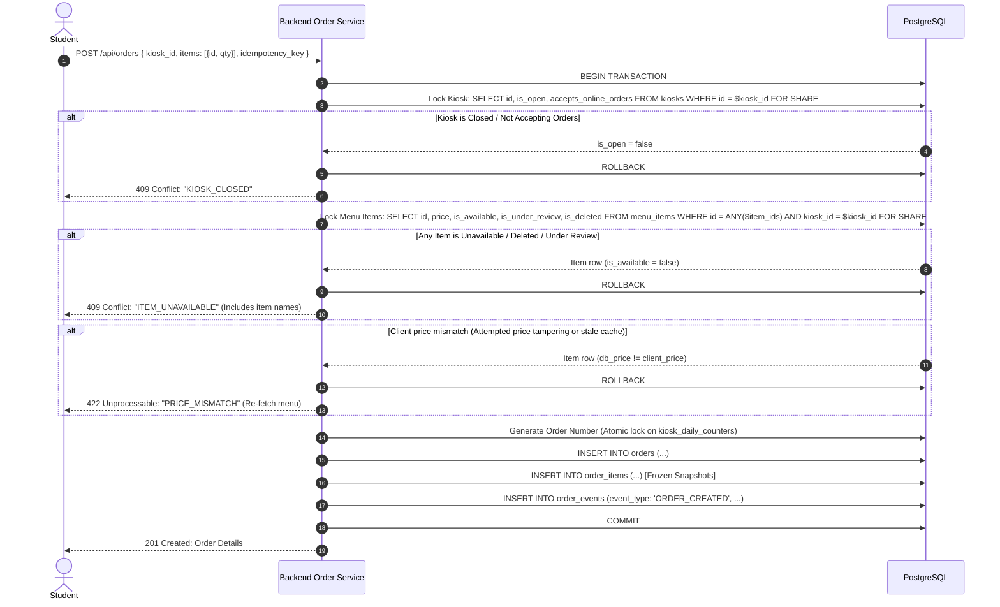
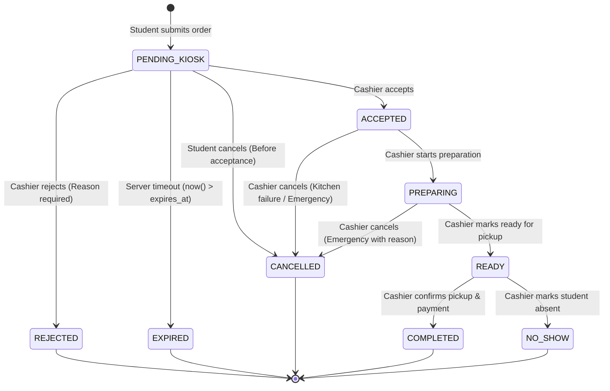
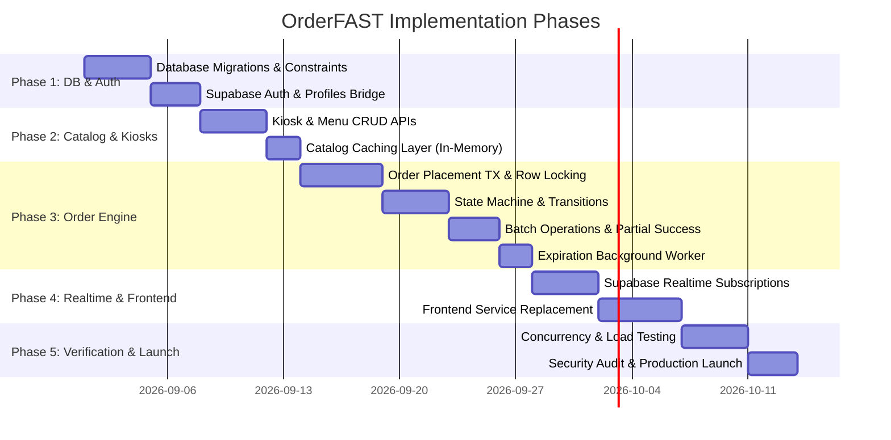

# OrderFAST — Database & Backend Architecture (Revision V2)

> **Document Version**: 2.0.0  
> **Status**: Comprehensive Revision — Prepared for User Review & Formal Approval  
> **Execution Gate**: NO CODE, SQL, MIGRATIONS, OR BACKEND FILES WILL BE CREATED BEFORE FINAL APPROVAL.

---

## Architecture Revision Summary (V1 ➡️ V2 Decision Log)

| Area | V1 Design | V2 Decision | Status | Rationale |
|---|---|---|---|---|
| **Identity / Auth** | `users.id` + `users.supabase_auth_id` | `auth.users.id` 1:1 with `profiles.id` | **CHANGE** | Eliminates dual identity; `auth.users` is the single source of truth for identity. |
| **Role Modeling** | `users.role` + `kiosk_staff.role` mixed | `profiles.system_role` vs `kiosk_staff.role` | **CHANGE** | Strict separation: Global system permissions vs kiosk-scoped operational permissions. |
| **ID Generation** | Claimed UUID v7, used `gen_random_uuid()` | App-layer UUIDv7 via standard library | **CHANGE** | Corrected invalid assumption; time-sortable UUIDv7 generated at application layer. |
| **Order Number** | `KKDD-NNNN` via daily cron reset | Atomic `kiosk_daily_counters` with row lock | **CHANGE** | Concurrency-safe, DB-enforced, collision-free, no cron dependency. |
| **Availability Race** | "Validate before insert" | `SELECT ... FOR SHARE` inside order TX | **CHANGE** | Row locking guarantees consistent snapshot during order placement. |
| **Prep Time Model** | `estimated_prep_time_mins` + `custom_mins` | `orders.estimated_ready_at` (TIMESTAMPTZ) | **CHANGE** | Timestamp is single source of truth; updates trigger `order_events`. |
| **Queue Semantics** | Static snapshot only | Snapshot at creation + Live SQL calculation | **CHANGE** | Clearly differentiates historical receipt data from live student queue tracking. |
| **Cancellation** | Grace period in `ACCEPTED` assumed | Student cancel only in `PENDING_KIOSK` | **CHANGE** | Aligns with frontend; prevents food waste; cashier can reject/cancel with logged reason. |
| **Payment Model** | General subtotal/total | `payment_method` + `payment_status` (on pickup) | **CHANGE** | Lightweight, exact fit for cash/wallet campus payments without premature gateway bloat. |
| **Notifications** | Row insert assumed delivery | `notifications` (Inbox) + Outbox-Ready Event Hook | **CHANGE** | Decouples DB record creation from external delivery mechanisms (Push/SMS). |
| **Outbox Pattern** | "Not required" | Outbox-Ready architecture (interfaces defined) | **CHANGE** | No outbox table in V1, but code structure allows zero-refactor V2 outbox injection. |
| **Batch Actions** | General batch description | Single TX + atomic per-order check + 207 response | **CHANGE** | Explicit partial success semantics and rollback behavior. |
| **Redis / Caching** | V1 In-memory vs Redis ambiguity | `ICacheService` interface (V1 Memory, V2 Redis) | **CHANGE** | Zero coupling to Redis in V1; seamless swap for horizontal scaling in V2. |
| **Framework Choice** | "Fastify matches Go" benchmark claim | Pragmatic TS stack evaluation | **CHANGE** | Reframed on maintainability, shared types, team speed, and PostgreSQL I/O performance. |
| **Money Type** | Integer Piasters | Integer Piasters (120 EGP = 12000) | **KEEP** | Absolute financial precision, zero float rounding errors. |
| **Order Events** | Combined `order_events` log | Immutable append-only `order_events` | **KEEP** | Complete audit trail for all status transitions and operational adjustments. |

---

## 1. Identity, Auth & Role Architecture

### 1.1 Single Source of Truth for Identity

We eliminate duplicate identity keys. **`auth.users.id` (Supabase Auth) is the primary key for all user entities.**

```
       ┌──────────────────────────────┐
       │     auth.users (Supabase)     │
       │  - id: UUID (Primary Key)    │
       │  - email: TEXT               │
       │  - encrypted_password: TEXT  │
       └──────────────┬───────────────┘
                      │ 1:1 (ON DELETE CASCADE)
                      ▼
       ┌──────────────────────────────┐
       │           profiles           │
       │  - id: UUID (PK = auth.uid)  │
       │  - full_name: TEXT           │
       │  - phone: TEXT               │
       │  - avatar_url: TEXT          │
       │  - system_role: ENUM         │
       │  - is_active: BOOLEAN        │
       │  - created_at: TIMESTAMPTZ   │
       │  - updated_at: TIMESTAMPTZ   │
       └──────┬────────────────┬──────┘
              │ 1:1            │ 1:N
              ▼                ▼
┌────────────────────────┐  ┌─────────────────────────┐
│        students        │  │       kiosk_staff       │
│ - id: UUID (PK = auth) │  │ - id: UUID (PK)         │
│ - university_id: TEXT  │  │ - kiosk_id: UUID (FK)   │
│ - college: TEXT        │  │ - user_id: UUID (FK)    │
│ - account_status: ENUM │  │ - role: ENUM            │
│ - no_show_count: INT   │  │ - is_active: BOOLEAN    │
└────────────────────────┘  └─────────────────────────┘
```

### 1.2 Separation of Global Roles vs. Kiosk-Scoped Roles

To prevent role collisions (e.g., a cashier who is also an owner at another kiosk, or an admin ordering as a student):

1. **Global System Role (`profiles.system_role`)**:
   - `student`: Standard platform consumer.
   - `staff`: Kiosk operator / cashier / kiosk owner.
   - `admin`: University campus administrator with global platform supervision.
2. **Kiosk-Scoped Operational Role (`kiosk_staff.role`)**:
   - `owner`: Can edit kiosk settings, manage menu items, toggle kiosk open/close, manage staff.
   - `cashier`: Can view incoming orders, accept/reject, update prep state, mark ready/completed/no-show, toggle item availability.

#### Authorization Decision Rules:
- A user with `system_role = 'admin'` has global read/write access to administrative endpoints (`/api/admin/*`).
- An endpoint modifying kiosk $K$ requires that the requesting user either:
  1. Has `system_role = 'admin'`, OR
  2. Has an active record in `kiosk_staff` where `user_id = auth.uid()`, `kiosk_id = K`, `is_active = true`, and `role IN (required_roles)`.
- A student ordering food requires `system_role = 'student'` and `students.account_status != 'restricted'`.

---

## 2. ID & UUID Strategy

### Decision: Application-Layer UUID v7

We use **UUID v7** (RFC 9562) as the primary key format for all application domain tables (`kiosks`, `menu_categories`, `menu_items`, `orders`, `order_items`, `order_events`, `notifications`).

#### Technical Specification:
1. **Why not PostgreSQL `gen_random_uuid()`?** `gen_random_uuid()` generates UUID v4 (purely random). UUID v4 causes index fragmentation in large B-trees because inserts are randomly distributed across index pages.
2. **Why UUID v7?** UUID v7 embeds a 48-bit millisecond timestamp in the high bits, making IDs **monotonically increasing / time-sortable**. This gives B-tree index performance nearly identical to `BIGINT` sequential keys while preserving UUID decentralization and security (unguessable, non-sequential in low bits).
3. **Generation Point**: Generated at the **Backend Application Layer** (Node.js using the standard, zero-dependency `uuidv7` package) before inserting into PostgreSQL.
4. **PostgreSQL Column Type**: `UUID` (standard 128-bit storage).
5. **Database Default Fallback**: If an insert occurs directly via SQL/migration without an app-supplied ID, a database fallback default can be used:
   ```sql
   -- For standard PG without extensions, fallback default:
   id UUID PRIMARY KEY DEFAULT gen_random_uuid()
   -- When app inserts, it passes explicit UUIDv7: INSERT INTO orders (id, ...) VALUES ($uuidv7, ...)
   ```

---

## 3. Order Number Generation Strategy

### Requirements:
- Short & human-friendly for student and cashier display (e.g., `#0142` or `#K1-042`).
- **Atomic & Concurrent-safe**: Zero duplicate order numbers even if 50 students submit orders at the exact same millisecond.
- **Database-enforced**: No reliance on JavaScript random numbers or daily cron resets.
- **Scope**: Per-Kiosk Daily Sequence.

### Implementation: Atomic Counter Table (`kiosk_daily_counters`)

```sql
CREATE TABLE kiosk_daily_counters (
    kiosk_id UUID NOT NULL REFERENCES kiosks(id) ON DELETE CASCADE,
    counter_date DATE NOT NULL,
    last_number INTEGER NOT NULL DEFAULT 0,
    PRIMARY KEY (kiosk_id, counter_date)
);
```

### Atomic Generation SQL (Inside Order Creation Transaction):

```sql
-- Step inside BEGIN TRANSACTION:
INSERT INTO kiosk_daily_counters (kiosk_id, counter_date, last_number)
VALUES ($kiosk_id, CURRENT_DATE, 1)
ON CONFLICT (kiosk_id, counter_date)
DO UPDATE SET last_number = kiosk_daily_counters.last_number + 1
RETURNING last_number;
```

#### Why this is 100% Robust:
1. **Row-Level Lock**: PostgreSQL acquires an exclusive row lock on the `(kiosk_id, CURRENT_DATE)` row during `UPDATE`. Concurrent transactions for the same kiosk wait for the lock and receive strictly incremented integers (1, 2, 3, ...).
2. **Zero Maintenance**: When a new day begins, `ON CONFLICT` doesn't trigger; it inserts row with `last_number = 1`. No cron job or scheduled task is required.
3. **Human-Friendly Formatting**: Formatted in application code or DB function as:
   - `#` + 4-digit padded number: e.g., `#0001`, `#0042`, `#0150`.
   - Stored in `orders.order_number` with a unique constraint: `UNIQUE (kiosk_id, order_date, order_number)`.

---

## 4. Product Availability & Kiosk Status Concurrency Model

### The Race Condition Scenario:
> Student opens Menu (Item is Available) ➡️ Cashier toggles Item to Unavailable ➡️ Student submits Order at the exact same instant.

### Concurrency Semantics & Execution Protocol:

Every order placement runs in a strict **Database Transaction (`READ COMMITTED` isolation with Explicit Row Locking)**:



#### Why `FOR SHARE` Locking is Critical:
- `FOR SHARE` locks the selected rows against concurrent modifications (`UPDATE menu_items SET is_available = false`).
- If a cashier clicks "Mark Unavailable" while an order is creating:
  - If Cashier TX commits first ➡️ Order TX reads `is_available = false` ➡️ Order safely aborted.
  - If Order TX acquires `FOR SHARE` first ➡️ Cashier TX waits until Order commits ➡️ Order is successfully created before the item becomes unavailable.
- Prevents phantom orders and guarantees **zero invalid orders are ever created**.

---

## 5. Preparation Time Model & Queue Semantics

### 5.1 Preparation Time Architecture

1. **Source of Truth**: `orders.estimated_ready_at` (TIMESTAMPTZ).
2. **Formula at Acceptance**:
   ```text
   estimated_ready_at = accepted_at + INTERVAL (effective_prep_time) MINUTE
   ```
   Where `effective_prep_time` is determined by:
   - If cashier specifies custom time on accept ➡️ `custom_prep_time_mins` (e.g., 35 mins for large order).
   - Else ➡️ `kiosks.default_prep_time_mins` + (if `kiosks.is_rush_mode` then 5 else 0).
3. **Mid-Preparation Time Adjustments**:
   - If cashier extends preparation time (e.g., +10 mins due to kitchen delay):
     ```sql
     UPDATE orders 
     SET estimated_ready_at = $new_ready_at, updated_at = now() 
     WHERE id = $order_id AND status = 'PREPARING';
     ```
   - An immutable event `PREPARATION_TIME_CHANGED` is inserted into `order_events` containing `{ old_ready_at, new_ready_at, reason }`.
   - Changing kiosk-level `default_prep_time_mins` or toggling `is_rush_mode` **only impacts future orders**; it NEVER mutates already accepted orders.

### 5.2 Queue Semantics: Snapshot vs. Live Calculation

| Concept | Definition | Storage / Implementation |
|---|---|---|
| **Initial Queue Snapshot** | Number of active orders ahead of this order *at the moment of creation*. Stored for historical context and auditing. | `orders.orders_ahead_snapshot` (INTEGER) |
| **Live Approximate Queue** | Dynamic count of pending/preparing orders ahead of the student *right now*. Displayed on student tracking screen. | Calculated on-the-fly via indexed query (see below). |

#### Live Queue Calculation Query:
```sql
-- Count active orders ahead of order $target_id in kiosk $kiosk_id:
SELECT COUNT(*) AS orders_ahead
FROM orders
WHERE kiosk_id = $kiosk_id
  AND status IN ('ACCEPTED', 'PREPARING')
  AND created_at < (SELECT created_at FROM orders WHERE id = $target_id);
```

- **Accuracy**: Semantically exact for active kitchen workload, approximate for physical queue.
- **Performance**: Sub-millisecond execution powered by index `idx_orders_kiosk_active_queue` on `(kiosk_id, status, created_at)`.

---

## 6. Order State Machine & Cancellation Rules

### 6.1 State Machine Diagram



### 6.2 State Transition Matrix & Actor Permissions

| From State | To State | Trigger / Actor | Business Conditions & Validations |
|---|---|---|---|
| *None* | `PENDING_KIOSK` | Student | Kiosk open, items available, student not restricted, idempotency check passed. |
| `PENDING_KIOSK` | `ACCEPTED` | Cashier | `now() <= expires_at`. Sets `accepted_at` and calculates `estimated_ready_at`. |
| `PENDING_KIOSK` | `REJECTED` | Cashier | `rejection_reason` is mandatory. Sets `rejected_at`. |
| `PENDING_KIOSK` | `EXPIRED` | System Worker | `now() > expires_at`. Batch updated by worker. Sets `expired_at`. |
| `PENDING_KIOSK` | `CANCELLED` | Student | Permitted only while in `PENDING_KIOSK`. Sets `cancelled_at`. |
| `ACCEPTED` | `PREPARING` | Cashier | Kitchen begins prep. Sets `preparing_at`. |
| `ACCEPTED` | `CANCELLED` | Cashier | Kitchen breakdown / ingredient failure. Reason required. Sets `cancelled_at`. |
| `PREPARING` | `READY` | Cashier | Order prepared and packaged. Sets `ready_at`. |
| `PREPARING` | `CANCELLED` | Cashier | Equipment failure. Reason required. Sets `cancelled_at`. |
| `READY` | `COMPLETED` | Cashier | Student picks up & pays. Sets `completed_at`, `payment_status = 'paid'`. |
| `READY` | `NO_SHOW` | Cashier | Student failed to show. Sets `no_show_at`, increments `students.no_show_count`. |

### 6.3 Strict Cancellation Rules (V2 Specification)
- **Student Cancellation**: Permitted **ONLY** while status is `PENDING_KIOSK`. Once the cashier clicks "Accept", student cancellation is disabled in the API to prevent food waste.
- **Cashier Cancellation**: Allowed at `ACCEPTED` or `PREPARING` only with a logged operational reason (e.g., machine failure, burnt batch). Logged in `order_events`.
- **Illegal Transitions**: Any transition not in the matrix is rejected by the backend state machine with `409 Conflict: INVALID_STATE_TRANSITION`.

---

## 7. Order Events, History & Audit Model

### Clear Separation of Concerns:
1. **`orders` Table**: Represents the **Current Operational State**. Contains current `status`, current `estimated_ready_at`, and milestone timestamps (`created_at`, `accepted_at`, `ready_at`, `completed_at`, etc.) for indexed queries and fast filtering.
2. **`order_events` Table**: An **Immutable Append-Only Log**. Every state change, time adjustment, or operational event produces an immutable row.

```sql
CREATE TABLE order_events (
    id UUID PRIMARY KEY DEFAULT gen_random_uuid(),
    order_id UUID NOT NULL REFERENCES orders(id) ON DELETE CASCADE,
    event_type TEXT NOT NULL, 
    -- 'ORDER_CREATED', 'STATUS_CHANGED', 'PREP_TIME_ADJUSTED', 'ORDER_REJECTED', 'ORDER_CANCELLED', 'NO_SHOW_RECORDED'
    from_status TEXT,
    to_status TEXT,
    actor_id UUID REFERENCES profiles(id),
    actor_type TEXT NOT NULL CHECK (actor_type IN ('student', 'staff', 'admin', 'system')),
    metadata JSONB NOT NULL DEFAULT '{}'::jsonb,
    created_at TIMESTAMPTZ NOT NULL DEFAULT now()
);
```

---

## 8. Payment & Financial Model

### 8.1 On-Campus Payment Specification
- Payment occurs physically at the kiosk upon pickup (Cash or University Digital Wallet/InstaPay).
- No third-party payment gateway (Stripe/Paymob) in V1.
- All monetary values are strictly **Integer Piasters** (1 EGP = 100 Piasters).

### 8.2 Payment Attributes on `orders`:
```sql
payment_method TEXT NOT NULL DEFAULT 'cash' CHECK (payment_method IN ('cash', 'digital_wallet')),
payment_status TEXT NOT NULL DEFAULT 'pending_at_pickup' CHECK (payment_status IN ('pending_at_pickup', 'paid', 'waived')),
subtotal INTEGER NOT NULL CHECK (subtotal >= 0),
discount INTEGER NOT NULL DEFAULT 0 CHECK (discount >= 0),
fees INTEGER NOT NULL DEFAULT 0 CHECK (fees >= 0),
total INTEGER NOT NULL CHECK (total >= 0),
CONSTRAINT check_order_total_math CHECK (total = subtotal - discount + fees)
```

- When Cashier clicks "Complete Order" (`READY` ➡️ `COMPLETED`), `payment_status` automatically transitions to `'paid'`.

---

## 9. Comprehensive Database ERD Proposal (DDL Spec)

```sql
-- Enable necessary extensions
CREATE EXTENSION IF NOT EXISTS "pgcrypto";

-- Enum Types
CREATE TYPE system_role_enum AS ENUM ('student', 'staff', 'admin');
CREATE TYPE account_status_enum AS ENUM ('active', 'warning', 'restricted');
CREATE TYPE kiosk_role_enum AS ENUM ('owner', 'cashier');
CREATE TYPE order_status_enum AS ENUM (
    'PENDING_KIOSK',
    'ACCEPTED',
    'PREPARING',
    'READY',
    'COMPLETED',
    'REJECTED',
    'EXPIRED',
    'CANCELLED',
    'NO_SHOW'
);
CREATE TYPE payment_method_enum AS ENUM ('cash', 'digital_wallet');
CREATE TYPE payment_status_enum AS ENUM ('pending_at_pickup', 'paid', 'waived');

-- 1. Profiles Table (1:1 with auth.users)
CREATE TABLE profiles (
    id UUID PRIMARY KEY REFERENCES auth.users(id) ON DELETE CASCADE,
    full_name TEXT NOT NULL,
    phone TEXT,
    avatar_url TEXT,
    system_role system_role_enum NOT NULL DEFAULT 'student',
    is_active BOOLEAN NOT NULL DEFAULT true,
    created_at TIMESTAMPTZ NOT NULL DEFAULT now(),
    updated_at TIMESTAMPTZ NOT NULL DEFAULT now()
);

-- 2. Students Table (Profile Extension for Students)
CREATE TABLE students (
    id UUID PRIMARY KEY REFERENCES profiles(id) ON DELETE CASCADE,
    university_id TEXT UNIQUE NOT NULL,
    college TEXT NOT NULL,
    account_status account_status_enum NOT NULL DEFAULT 'active',
    no_show_count INTEGER NOT NULL DEFAULT 0 CHECK (no_show_count >= 0),
    created_at TIMESTAMPTZ NOT NULL DEFAULT now(),
    updated_at TIMESTAMPTZ NOT NULL DEFAULT now()
);

-- 3. Kiosks Table
CREATE TABLE kiosks (
    id UUID PRIMARY KEY DEFAULT gen_random_uuid(),
    name TEXT NOT NULL,
    college_location TEXT NOT NULL,
    campus_zone TEXT,
    category TEXT NOT NULL DEFAULT 'عام',
    is_open BOOLEAN NOT NULL DEFAULT false,
    accepts_online_orders BOOLEAN NOT NULL DEFAULT true,
    is_rush_mode BOOLEAN NOT NULL DEFAULT false,
    opening_hours TEXT NOT NULL DEFAULT '8:00 ص - 4:00 م',
    phone TEXT,
    rating NUMERIC(3,2) NOT NULL DEFAULT 5.00 CHECK (rating >= 0 AND rating <= 5),
    default_prep_time_mins INTEGER NOT NULL DEFAULT 15 CHECK (default_prep_time_mins > 0),
    acceptance_timeout_secs INTEGER NOT NULL DEFAULT 300 CHECK (acceptance_timeout_secs >= 60),
    image_url TEXT,
    created_at TIMESTAMPTZ NOT NULL DEFAULT now(),
    updated_at TIMESTAMPTZ NOT NULL DEFAULT now()
);

-- 4. Kiosk Staff Table (M:N Staff Assignment)
CREATE TABLE kiosk_staff (
    id UUID PRIMARY KEY DEFAULT gen_random_uuid(),
    kiosk_id UUID NOT NULL REFERENCES kiosks(id) ON DELETE CASCADE,
    user_id UUID NOT NULL REFERENCES profiles(id) ON DELETE CASCADE,
    role kiosk_role_enum NOT NULL DEFAULT 'cashier',
    is_active BOOLEAN NOT NULL DEFAULT true,
    created_at TIMESTAMPTZ NOT NULL DEFAULT now(),
    UNIQUE (kiosk_id, user_id)
);

-- 5. Kiosk Daily Counters (For Atomic Sequential Order Numbers)
CREATE TABLE kiosk_daily_counters (
    kiosk_id UUID NOT NULL REFERENCES kiosks(id) ON DELETE CASCADE,
    counter_date DATE NOT NULL DEFAULT CURRENT_DATE,
    last_number INTEGER NOT NULL DEFAULT 0,
    PRIMARY KEY (kiosk_id, counter_date)
);

-- 6. Menu Categories Table
CREATE TABLE menu_categories (
    id UUID PRIMARY KEY DEFAULT gen_random_uuid(),
    kiosk_id UUID NOT NULL REFERENCES kiosks(id) ON DELETE CASCADE,
    name TEXT NOT NULL,
    display_order INTEGER NOT NULL DEFAULT 0,
    is_active BOOLEAN NOT NULL DEFAULT true,
    created_at TIMESTAMPTZ NOT NULL DEFAULT now(),
    updated_at TIMESTAMPTZ NOT NULL DEFAULT now()
);

-- 7. Menu Items Table
CREATE TABLE menu_items (
    id UUID PRIMARY KEY DEFAULT gen_random_uuid(),
    kiosk_id UUID NOT NULL REFERENCES kiosks(id) ON DELETE CASCADE,
    category_id UUID NOT NULL REFERENCES menu_categories(id) ON DELETE CASCADE,
    name TEXT NOT NULL,
    description TEXT,
    price INTEGER NOT NULL CHECK (price > 0), -- Piasters (e.g., 2000 = 20 EGP)
    is_available BOOLEAN NOT NULL DEFAULT true,
    is_under_review BOOLEAN NOT NULL DEFAULT true,
    preparation_time_mins INTEGER NOT NULL DEFAULT 5 CHECK (preparation_time_mins > 0),
    image_url TEXT,
    is_deleted BOOLEAN NOT NULL DEFAULT false,
    created_at TIMESTAMPTZ NOT NULL DEFAULT now(),
    updated_at TIMESTAMPTZ NOT NULL DEFAULT now()
);

-- 8. Orders Table
CREATE TABLE orders (
    id UUID PRIMARY KEY DEFAULT gen_random_uuid(),
    order_number TEXT NOT NULL,
    order_date DATE NOT NULL DEFAULT CURRENT_DATE,
    student_id UUID NOT NULL REFERENCES profiles(id),
    kiosk_id UUID NOT NULL REFERENCES kiosks(id),
    status order_status_enum NOT NULL DEFAULT 'PENDING_KIOSK',
    idempotency_key UUID UNIQUE NOT NULL,
    
    -- Financials in Piasters
    subtotal INTEGER NOT NULL CHECK (subtotal >= 0),
    discount INTEGER NOT NULL DEFAULT 0 CHECK (discount >= 0),
    fees INTEGER NOT NULL DEFAULT 0 CHECK (fees >= 0),
    total INTEGER NOT NULL CHECK (total >= 0),
    payment_method payment_method_enum NOT NULL DEFAULT 'cash',
    payment_status payment_status_enum NOT NULL DEFAULT 'pending_at_pickup',
    
    -- Operational & Queue Snapshots
    rejection_reason TEXT,
    cancellation_reason TEXT,
    orders_ahead_snapshot INTEGER NOT NULL DEFAULT 0,
    student_name_snapshot TEXT NOT NULL,
    student_college_snapshot TEXT NOT NULL,
    kiosk_name_snapshot TEXT NOT NULL,
    
    -- Timeline Timestamps
    expires_at TIMESTAMPTZ NOT NULL,
    estimated_ready_at TIMESTAMPTZ,
    accepted_at TIMESTAMPTZ,
    preparing_at TIMESTAMPTZ,
    ready_at TIMESTAMPTZ,
    completed_at TIMESTAMPTZ,
    rejected_at TIMESTAMPTZ,
    cancelled_at TIMESTAMPTZ,
    expired_at TIMESTAMPTZ,
    no_show_at TIMESTAMPTZ,
    created_at TIMESTAMPTZ NOT NULL DEFAULT now(),
    updated_at TIMESTAMPTZ NOT NULL DEFAULT now(),
    
    CONSTRAINT check_order_total_calc CHECK (total = subtotal - discount + fees),
    UNIQUE (kiosk_id, order_date, order_number)
);

-- 9. Order Items Table (Frozen Historical Snapshots)
CREATE TABLE order_items (
    id UUID PRIMARY KEY DEFAULT gen_random_uuid(),
    order_id UUID NOT NULL REFERENCES orders(id) ON DELETE CASCADE,
    menu_item_id UUID REFERENCES menu_items(id) ON DELETE SET NULL,
    name_snapshot TEXT NOT NULL,
    unit_price_snapshot INTEGER NOT NULL CHECK (unit_price_snapshot > 0), -- Piasters
    quantity INTEGER NOT NULL CHECK (quantity > 0),
    line_total INTEGER NOT NULL CHECK (line_total > 0),
    special_instructions TEXT,
    created_at TIMESTAMPTZ NOT NULL DEFAULT now(),
    CONSTRAINT check_line_total_calc CHECK (line_total = unit_price_snapshot * quantity)
);

-- 10. Order Events Table (Immutable Audit Trail)
CREATE TABLE order_events (
    id UUID PRIMARY KEY DEFAULT gen_random_uuid(),
    order_id UUID NOT NULL REFERENCES orders(id) ON DELETE CASCADE,
    event_type TEXT NOT NULL,
    from_status order_status_enum,
    to_status order_status_enum,
    actor_id UUID REFERENCES profiles(id),
    actor_type TEXT NOT NULL CHECK (actor_type IN ('student', 'staff', 'admin', 'system')),
    metadata JSONB NOT NULL DEFAULT '{}'::jsonb,
    created_at TIMESTAMPTZ NOT NULL DEFAULT now()
);

-- 11. Notifications Table (User In-App Inbox)
CREATE TABLE notifications (
    id UUID PRIMARY KEY DEFAULT gen_random_uuid(),
    user_id UUID NOT NULL REFERENCES profiles(id) ON DELETE CASCADE,
    order_id UUID REFERENCES orders(id) ON DELETE CASCADE,
    type TEXT NOT NULL CHECK (type IN ('order_status', 'kiosk_notice', 'system', 'warning')),
    title TEXT NOT NULL,
    body TEXT NOT NULL,
    is_read BOOLEAN NOT NULL DEFAULT false,
    created_at TIMESTAMPTZ NOT NULL DEFAULT now()
);
```

---

## 10. Real-World Query & Indexing Strategy

Every index is mapped 1:1 to an actual application query:

```sql
-- 1. Cashier Dashboard: Active Orders by Kiosk & Status
-- Query: SELECT * FROM orders WHERE kiosk_id = $kiosk_id AND status IN ('ACCEPTED', 'PREPARING', 'READY') ORDER BY created_at ASC;
CREATE INDEX idx_orders_kiosk_active 
ON orders (kiosk_id, status, created_at ASC);

-- 2. Cashier Incoming Orders (Pending Review)
-- Query: SELECT * FROM orders WHERE kiosk_id = $kiosk_id AND status = 'PENDING_KIOSK' ORDER BY created_at ASC;
CREATE INDEX idx_orders_kiosk_incoming 
ON orders (kiosk_id, created_at ASC) 
WHERE status = 'PENDING_KIOSK';

-- 3. Student Order History (Paginated)
-- Query: SELECT * FROM orders WHERE student_id = $student_id ORDER BY created_at DESC LIMIT 20 OFFSET $offset;
CREATE INDEX idx_orders_student_history 
ON orders (student_id, created_at DESC);

-- 4. Order Expiration Background Worker
-- Query: SELECT id FROM orders WHERE status = 'PENDING_KIOSK' AND expires_at < now();
CREATE INDEX idx_orders_pending_expiry 
ON orders (expires_at) 
WHERE status = 'PENDING_KIOSK';

-- 5. Student Menu Browsing
-- Query: SELECT * FROM menu_items WHERE kiosk_id = $kiosk_id AND is_available = true AND is_under_review = false AND is_deleted = false ORDER BY category_id, name;
CREATE INDEX idx_menu_items_student_browse 
ON menu_items (kiosk_id, category_id) 
WHERE is_deleted = false AND is_available = true AND is_under_review = false;

-- 6. Admin Menu Review Queue
-- Query: SELECT * FROM menu_items WHERE is_under_review = true AND is_deleted = false ORDER BY created_at ASC;
CREATE INDEX idx_menu_items_under_review 
ON menu_items (created_at ASC) 
WHERE is_under_review = true AND is_deleted = false;

-- 7. Live Queue Length Calculation
-- Query: SELECT COUNT(*) FROM orders WHERE kiosk_id = $kiosk_id AND status IN ('ACCEPTED', 'PREPARING') AND created_at < $target_time;
CREATE INDEX idx_orders_kiosk_active_queue 
ON orders (kiosk_id, created_at) 
WHERE status IN ('ACCEPTED', 'PREPARING');

-- 8. User Unread Notifications
-- Query: SELECT * FROM notifications WHERE user_id = $user_id AND is_read = false ORDER BY created_at DESC;
CREATE INDEX idx_notifications_user_unread 
ON notifications (user_id, created_at DESC) 
WHERE is_read = false;
```

---

## 11. Transaction Strategy & Batch Operations Semantics

### 11.1 Batch Operations Execution Semantics

Cashiers can perform batch operations on orders (e.g., Accept 5 orders, Mark 3 orders Ready).

#### Exact Protocol:
- **Transaction Boundary**: The entire batch runs in a **Single PostgreSQL Transaction**.
- **Individual Order State Check**: Each order transition is executed with an atomic conditional `UPDATE ... WHERE id = $id AND status = $expected_status AND kiosk_id = $cashier_kiosk_id RETURNING id`.
- **Partial Success Handling**:
  - If 3 orders are in valid states and 2 have expired/already transitioned:
    - The 3 valid orders transition successfully and write their `order_events`.
    - The 2 invalid orders are identified because `UPDATE` returned 0 rows.
    - The transaction commits the 3 successful transitions.
  - The API responds with `207 Multi-Status` (or standard `200 OK` with structured payload):
    ```json
    {
      "success_count": 3,
      "failure_count": 2,
      "succeeded": ["uuid-1", "uuid-2", "uuid-3"],
      "failed": [
        { "id": "uuid-4", "reason": "Order already expired", "code": "ORDER_EXPIRED" },
        { "id": "uuid-5", "reason": "Order is not in PENDING_KIOSK state", "code": "INVALID_STATE" }
      ]
    }
    ```
- **System Failure Rollback**: If an unexpected DB connection failure or server crash occurs mid-batch, the entire transaction automatically rolls back cleanly via PostgreSQL ACID guarantees.

---

## 12. Realtime & Notifications Architecture

### 12.1 Separation of Notification Record vs. Delivery

```
                       ┌────────────────────────┐
                       │  Order State Change    │
                       └───────────┬────────────┘
                                   │ (Inside DB Transaction)
                                   ▼
                       ┌────────────────────────┐
                       │  INSERT INTO           │
                       │  notifications (Inbox) │
                       └───────────┬────────────┘
                                   │ (Transaction Commits)
                                   ▼
                       ┌────────────────────────┐
                       │  PostgreSQL WAL        │
                       └───────────┬────────────┘
                                   │
               ┌───────────────────┴───────────────────┐
               ▼                                       ▼
     ┌───────────────────┐                   ┌───────────────────┐
     │ Supabase Realtime │                   │ Future Outbox /   │
     │ WebSocket Channel │                   │ Push Dispatcher   │
     │ (In-App Live UI)  │                   │ (FCM / APNS / SMS)│
     └───────────────────┘                   └───────────────────┘
```

1. **In-App Notification Record (`notifications` table)**: Written synchronously inside the order state transition transaction. Guarantees that if the order state updates, the in-app notification inbox row exists.
2. **Realtime Broadcast**: Supabase Realtime listens to PostgreSQL logical replication (WAL). It broadcasts lightweight event payloads over WebSocket channels to connected clients.
3. **Outbox-Ready Delivery Pipeline**:
   - In V1, notifications are delivered in-app via Realtime.
   - For V2 push notifications (Firebase/APNS/SMS), an event dispatcher hook or an `outbox_messages` table will consume PostgreSQL WAL/Database Webhooks to trigger external delivery asynchronously without blocking or failing database transactions.

---

## 13. Redis & Caching Strategy

### 13.1 Clear Staging: V1 Local In-Memory ➡️ V2 Distributed Redis

```typescript
// Shared Cache Interface in packages/types or apps/api/src/shared/cache
export interface ICacheService {
  get<T>(key: string): Promise<T | null>;
  set<T>(key: string, value: T, ttlSeconds: number): Promise<void>;
  del(key: string): Promise<void>;
  delPattern(pattern: string): Promise<void>;
}
```

- **Phase V1 (Single Node API)**: `MemoryCacheService` implemented using an LRU cache (e.g. `lru-cache`). Fast, zero infrastructure overhead, zero network hop.
- **Phase V2 (Horizontal Scaling)**: `RedisCacheService` implementing `ICacheService` swapped in via dependency injection when multiple backend replicas are deployed.

### 13.2 Strict Cache Boundaries (What is Cached vs. Never Cached)

| Data Entity | Caching Rule | TTL | Invalidation Trigger |
|---|---|---|---|
| **Kiosk Public Menu** | Cached | 60 seconds | Kiosk staff modifies item, price, or category (`del("kiosk:menu:$id")`). |
| **Kiosk Info & Open State** | Cached | 30 seconds | Kiosk staff toggles open/closed or rush mode. |
| **Active Order States** | **NEVER CACHED** | 0s | Always queried directly from PostgreSQL with indexed lookups. |
| **Financial / Totals** | **NEVER CACHED** | 0s | Calculated and verified authoritatively in PostgreSQL. |
| **Auth & Permissions** | Token Verified | Stateless | Verified on each request via Supabase JWT validation. |

---

## 14. Security & RLS Defense-in-Depth

### 14.1 Two-Tiered Security Architecture
1. **Primary Tier (Application-Layer RBAC & Input Validation)**:
   - Zod schema validation on every request body and query parameter.
   - Fastify authentication & authorization pre-handler hooks verifying user roles and kiosk ownership.
2. **Defense-in-Depth Tier (PostgreSQL Row-Level Security)**:
   - Enforces table-level isolation directly in the database.

### 14.2 Clean Helper Functions & RLS Policies

```sql
-- Helper function to check if auth.uid() is active staff at given kiosk
CREATE OR REPLACE FUNCTION is_kiosk_staff(kiosk_uuid UUID)
RETURNS BOOLEAN LANGUAGE sql SECURITY DEFINER STABLE AS $$
  SELECT EXISTS (
    SELECT 1 FROM kiosk_staff
    WHERE kiosk_id = kiosk_uuid
      AND user_id = auth.uid()
      AND is_active = true
  );
$$;

-- Helper function to check if auth.uid() is platform admin
CREATE OR REPLACE FUNCTION is_platform_admin()
RETURNS BOOLEAN LANGUAGE sql SECURITY DEFINER STABLE AS $$
  SELECT EXISTS (
    SELECT 1 FROM profiles
    WHERE id = auth.uid()
      AND system_role = 'admin'
      AND is_active = true
  );
$$;

-- Enable RLS
ALTER TABLE orders ENABLE ROW LEVEL SECURITY;
ALTER TABLE menu_items ENABLE ROW LEVEL SECURITY;
ALTER TABLE notifications ENABLE ROW LEVEL SECURITY;

-- Orders RLS Policies
CREATE POLICY "students_view_own_orders" ON orders
  FOR SELECT USING (student_id = auth.uid());

CREATE POLICY "kiosk_staff_view_kiosk_orders" ON orders
  FOR SELECT USING (is_kiosk_staff(kiosk_id));

CREATE POLICY "admin_all_orders" ON orders
  FOR ALL USING (is_platform_admin());

-- Notifications RLS Policies
CREATE POLICY "users_view_own_notifications" ON notifications
  FOR SELECT USING (user_id = auth.uid());

CREATE POLICY "users_update_own_notifications" ON notifications
  FOR UPDATE USING (user_id = auth.uid())
  WITH CHECK (user_id = auth.uid());
```

---

## 15. Business Rule Ownership Matrix

Every business rule has a clear, unambiguous owner:

| Business Rule | Enforcing Layer | Mechanism / Method |
|---|---|---|
| **Price & Line Total Correctness** | Database & Backend Service | `CHECK` constraints in DB + Backend price recalculation from DB rows. |
| **Menu Item Availability Check** | Database Transaction | `SELECT ... FOR SHARE` inside order creation transaction. |
| **Kiosk Open / Closed Enforcement** | Database Transaction | `SELECT ... FOR SHARE` on `kiosks` table during order transaction. |
| **Order Number Sequential Generation** | Database Row Lock | Atomic increment on `kiosk_daily_counters`. |
| **Idempotency / Duplicate Prevention** | Database Unique Constraint | `orders.idempotency_key` UNIQUE index. |
| **Order State Transitions** | Application State Machine & DB | Pre-handler state machine validator + conditional `UPDATE ... WHERE status = $current`. |
| **Order Expiration** | Scheduled Background Worker | Periodic SQL batch update on `orders.expires_at < now()`. |
| **Student Account Restrictions** | Backend Service & DB Check | Verification that `students.account_status != 'restricted'` on order submission. |
| **Kiosk Management Authorization** | Backend RBAC & Supabase RLS | Auth pre-handlers + `is_kiosk_staff()` SQL helper function. |
| **Menu Item Approval Requirement** | Backend Service & DB Filter | `is_under_review = false` filter on student catalog queries. |

---

## 16. Practical Technology Stack Evaluation

| Evaluation Criteria | Node.js + Fastify + TypeScript (Selected) | Node.js + NestJS | Go (Golang) |
|---|---|---|---|
| **Monorepo Integration** | **Seamless**: Direct import of Zod schemas and TypeScript types from `packages/*`. | Good, but heavier decoratored DTO abstractions. | **Poor**: Requires duplicate type definitions in Go structs and separate build pipeline. |
| **Developer Velocity** | **High**: Lightweight, minimal boilerplate, instant route setup. | Medium: High boilerplate (Modules, Controllers, Providers). | Medium: Fast runtime, but slower domain modeling and migration tooling. |
| **I/O & Concurrency Performance** | **Excellent**: Low overhead, asynchronous event loop perfectly suited for PostgreSQL I/O. | Good: Same V8 engine, slightly higher framework overhead. | **Superior**: Native goroutines, but difference is negligible for DB-bound campus workload. |
| **PostgreSQL & Drizzle ORM** | **First-class**: Direct access to raw transactions, row locking, and type-safe SQL. | Good via TypeORM/Prisma, but complex for custom locking queries. | Good via `pgx` or `sqlc`. |
| **Supabase Client Support** | **Native**: First-party JS/TS SDK with full TypeScript definitions. | Native. | Community-maintained Go SDKs (lagging behind JS). |

**Conclusion**: **Node.js + Fastify + TypeScript** offers the optimal balance of developer velocity, shared type safety with the Next.js frontend, and exceptional I/O performance for PostgreSQL workloads.

---

## 17. API Boundaries & Endpoint Catalog (V2)

### 17.1 Auth & Profiles
- `POST /api/auth/register-student` — Registers student (Supabase Auth + `profiles` + `students`).
- `POST /api/auth/register-staff` — Registers kiosk staff member.
- `GET /api/profiles/me` — Returns authenticated profile and role metadata.

### 17.2 Catalog & Kiosks
- `GET /api/kiosks` — Lists active kiosks with wait times and status (Cached).
- `GET /api/kiosks/:id` — Kiosk details.
- `GET /api/kiosks/:id/menu` — Full menu categories and approved available items (Cached).
- `PATCH /api/kiosks/:id/status` — Owner/Cashier toggles open/closed state or rush mode.
- `PATCH /api/kiosks/:id/settings` — Owner updates wait time, opening hours, phone.
- `POST /api/kiosks/:id/menu-items` — Staff adds menu item (created with `is_under_review = true`).
- `PATCH /api/menu-items/:id` — Staff edits item details.
- `PATCH /api/menu-items/:id/availability` — Staff toggles availability.
- `DELETE /api/menu-items/:id` — Staff soft-deletes item.

### 17.3 Orders
- `POST /api/orders` — Student submits order (Requires `Idempotency-Key` header).
- `GET /api/orders/:id` — Order details with live queue status.
- `GET /api/orders/student/me` — Student order history (Paginated).
- `POST /api/orders/:id/cancel` — Student cancels order (Only valid in `PENDING_KIOSK`).
- `GET /api/kiosks/:id/orders/incoming` — Cashier incoming orders view (`PENDING_KIOSK`).
- `GET /api/kiosks/:id/orders/active` — Cashier active kitchen orders (`ACCEPTED`, `PREPARING`, `READY`).
- `POST /api/orders/:id/accept` — Cashier accepts single order (Sets `estimated_ready_at`).
- `POST /api/orders/:id/reject` — Cashier rejects order (Requires `reason`).
- `POST /api/orders/:id/start-preparing` — Cashier marks in preparation.
- `POST /api/orders/:id/mark-ready` — Cashier marks ready for pickup.
- `POST /api/orders/:id/complete` — Cashier confirms pickup & payment.
- `POST /api/orders/:id/no-show` — Cashier records student absence.
- `PATCH /api/orders/:id/estimated-time` — Cashier updates preparation estimate.
- `POST /api/orders/batch/accept` — Cashier batch accept (Returns 207 Multi-Status).
- `POST /api/orders/batch/reject` — Cashier batch reject.
- `POST /api/orders/batch/mark-ready` — Cashier batch mark ready.

### 17.4 Notifications
- `GET /api/notifications` — List user notifications (Paginated).
- `PATCH /api/notifications/:id/read` — Mark notification read.
- `PATCH /api/notifications/read-all` — Mark all user notifications read.

### 17.5 Admin Super-Operations
- `GET /api/admin/menu-review` — List items pending review across all kiosks.
- `POST /api/admin/menu-items/:id/approve` — Admin approves menu item.
- `POST /api/admin/menu-items/:id/reject` — Admin rejects menu item.
- `PATCH /api/admin/students/:id/status` — Admin modifies student status (`active`, `warning`, `restricted`).

---

## 18. Implementation Roadmap (Phased & Dependency-Ordered)



---

## 19. Risks, Trade-offs & Open Design Questions

### Risks & Mitigations
1. **Student Network Drop After Order Submit**: If student loses connection before receiving response, resubmitting with same `Idempotency-Key` returns existing order cleanly with no duplicate charges.
2. **Kiosk Inactive / Cashier Away**: Orders in `PENDING_KIOSK` automatically expire after kiosk's `acceptance_timeout_secs` (e.g., 5 mins) via worker, freeing student from indefinite waiting.
3. **High Peak Break Traffic (Rush Hour)**: Lightweight Fastify + indexed PostgreSQL queries easily handle 100+ concurrent order submissions without hitting connection pool limits.

### Open Design Questions for Review
1. **Multi-Item Option Groups**: In V2, should we add coffee customization tables (`item_option_groups` + `item_options`) or keep options as `special_instructions` text for initial release? *(Recommended: Text instructions in V1, formal option groups in V2).*
2. **Student Cancellation Grace Period**: We set student cancellation to be valid *only* while `PENDING_KIOSK`. Do you want to add a 30-second post-acceptance grace period, or keep it strictly pre-acceptance? *(Recommended: Keep strictly pre-acceptance to protect kiosks).*
