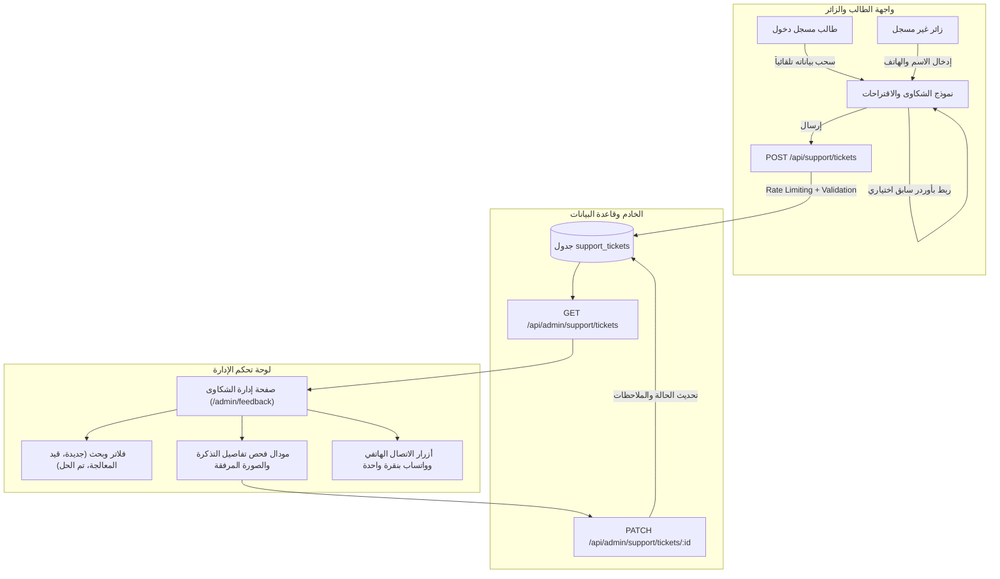

# خطة تنفيذ ميزة صفحة المشاكل والاقتراحات والدعم الفني (Student Feedback & Support System)

> **تاريخ الإنشاء:** 2026-09-29  
> **حالة الوثيقة:** معتمدة للتنفيذ  
> **المشروع:** OrderFAST Platform  

---

## 📌 1. النظرة العامة والهدف (Executive Summary)

تهدف هذه الميزة إلى توفير قناة تواصل رسمية واحترافية بين طلاب الجامعات (جامعة سفنكس وجامعة أسيوط الأهلية) وإدارة المنصة، من خلال:
1. **صفحة مخصصة للطلاب (مسجلين وغير مسجلين / زوار)**: تتيح إرسال المشاكل التقنية، شكاوى الطلبات، مشاكل الأكشاك، استفسارات الدفع، أو اقتراحات لتطوير التطبيق بشكل راقٍ ومباشر مع إمكانية إرفاق صور / سكرين شوت.
2. **لوحة تحكم كاملة للإدارة (Admin Support Dashboard)**: تمكّن الأدمن من متابعة كل الشكاوى والرسائل الواردة، فلترتها، فحص بيانات الطالب وسجل طلبه، التواصل الفوري معه عبر اتصال أو محادثة WhatsApp مباشرة بنقرة واحدة، وتحديث حالة المشكلة (قيد المعالجة / تم الحل).

---

## 🏛️ 2. مخطط تدفق البيانات (Architecture & Workflow Diagram)



---

## 💾 3. هيكل قاعدة البيانات (Database Schema)

### جدول `support_tickets`
ملف الـ Migration: `apps/api/src/db/migrations/0010_add_support_tickets.sql`

| الحقل (Field) | النوع (Type) | الوصف |
| :--- | :--- | :--- |
| `id` | `UUID` (PK) | المعرّف الفريد للتذكرة |
| `ticket_number` | `TEXT` | كود فريد وسهل للقراءة (مثلاً `#TKT-849201`) |
| `category` | `TEXT` | تصنيف المشكلة (`order_issue`, `kiosk_issue`, `payment_issue`, `app_bug`, `suggestion`, `other`) |
| `subject` | `TEXT` | عنوان المشكلة أو الاقتراح |
| `message` | `TEXT` | التفاصيل الكاملة لنص الرسالة |
| `image_url` | `TEXT` (Nullable) | رابط الصورة أو السكرين شوت المرفقة |
| `user_id` | `UUID` (Nullable) | معرّف الطالب إذا كان مسجلاً (Foreign Key إلى `profiles.id`) |
| `is_guest` | `BOOLEAN` | هل المرسل زائر غير مسجل؟ (`true` / `false`) |
| `sender_name` | `TEXT` | اسم الطالب / المرسل |
| `sender_phone` | `TEXT` | رقم الهاتف المعتمد للتواصل مع الطالب |
| `sender_email` | `TEXT` (Nullable) | البريد الإلكتروني للمرسل |
| `university` | `TEXT` | الجامعة (`sphinx` أو `assiut_ahleya`) |
| `college` | `TEXT` (Nullable) | الكلية (مثلاً: حاسبات، طب بشري، صيدلة، أسنان...) |
| `order_id` | `UUID` (Nullable) | معرّف الطلب إذا كانت المشكلة بخصوص أوردر معين |
| `order_number` | `TEXT` (Nullable) | رقم الطلب للعرض المباشر (مثل `#A-024`) |
| `kiosk_id` | `UUID` (Nullable) | معرّف الكشك المعني لو وُجد |
| `kiosk_name` | `TEXT` (Nullable) | اسم الكشك المعني |
| `status` | `TEXT` | حالة التذكرة (`pending`, `in_progress`, `resolved`, `closed`) |
| `priority` | `TEXT` | أولوية المشكلة (`low`, `normal`, `high`, `urgent`) |
| `admin_notes` | `TEXT` (Nullable) | ملاحظات داخلية لفريق الإدارة |
| `admin_reply` | `TEXT` (Nullable) | الرد الرسمي الموجه للطالب |
| `resolved_at` | `TIMESTAMPTZ` (Nullable) | وقت حل الشكوى |
| `created_at` | `TIMESTAMPTZ` | تاريخ ووقت الإرسال |
| `updated_at` | `TIMESTAMPTZ` | تاريخ آخر تحديث |

---

## 🔌 4. مسارات الـ API (API Specifications)

### 1. إرسال تذكرة / شكوى جديدة (للطلاب والزوار)
- **المسار:** `POST /api/support/tickets`
- **الصلاحية:** مفتوح للعامة (Public) + يتعرف تلقائياً على التوكن `Bearer Token` إذا كان الطالب مسجلاً.
- **الحماية:** Rate Limiter بمعدل أقصاه 5 رسائل في الدقيقة لكل IP لمنع السبام.
- **المدخلات (Request Body):**
  ```json
  {
    "category": "order_issue",
    "subject": "تأخر في تحضير الطلب وخصم خاطئ",
    "message": "طلبت من كشك هلا وجلس الأوردر 35 دقيقة بدون تجهيز...",
    "imageUrl": "https://.../screenshot.jpg", // اختياري
    "senderName": "محمد أحمد",
    "senderPhone": "01012345678",
    "senderEmail": "student@sphinx.edu.eg", // اختياري
    "university": "sphinx",
    "college": "كلية الهندسة",
    "orderId": "uuid-optional",
    "orderNumber": "A-042",
    "kioskId": "uuid-optional",
    "kioskName": "كشك هلا"
  }
  ```
- **المخرجات (Response 201):**
  ```json
  {
    "success": true,
    "message": "تم إرسال تذكرتك بنجاح، وسيتواصل معك فريق الدعم قريباً",
    "data": {
      "id": "uuid",
      "ticketNumber": "#TKT-849201",
      "status": "pending",
      "createdAt": "2026-09-29T21:30:00Z"
    }
  }
  ```

### 2. جلب جميع الشكاوى والمقترحات (خاص بالإدارة)
- **المسار:** `GET /api/admin/support/tickets`
- **الصلاحية:** مدراء النظام فقط `requireSystemRole(['admin'])`.
- **Query Parameters:**
  - `status`: `all` | `pending` | `in_progress` | `resolved` | `closed`
  - `category`: `order_issue` | `kiosk_issue` | `app_bug` | `suggestion` ...
  - `isGuest`: `true` | `false`
  - `search`: بحث بالاسم، رقم التذكرة، أو رقم الهاتف
  - `page`: رقم الصفحة (افتراضي: 1)
  - `limit`: عدد النتائج (افتراضي: 30)

### 3. إحصائيات الدعم الفني للأدمن (KPIs)
- **المسار:** `GET /api/admin/support/stats`
- **المخرجات:**
  - إجمالي التذاكر (`totalCount`)
  - التذاكر الجديدة غير المراجعة (`pendingCount`)
  - التذاكر قيد المتابعة (`inProgressCount`)
  - التذاكر المحلولة (`resolvedCount`)
  - تصنيف الشكاوى بالأكثر تكراراً

### 4. تحديث حالة التذكرة وإضافة الرد والملاحظات
- **المسار:** `PATCH /api/admin/support/tickets/:id`
- **الصلاحية:** مدراء النظام فقط.
- **المدخلات:**
  ```json
  {
    "status": "resolved", // pending | in_progress | resolved | closed
    "priority": "normal",
    "adminNotes": "تم التواصل مع الطالب وحل المشكلة مع كشك هلا",
    "adminReply": "أهلاً محمد، تم تصحيح الخطأ وإعادة المبلغ لمحفظتك بنجاح"
  }
  ```

### 5. متابعة الشكاوى السابقة للطالب المسجل
- **المسار:** `GET /api/support/my-tickets`
- **الصلاحية:** الطلاب المسجلين فقط (`authenticate`).
- يعرض قائمة التذاكر الخاصة بالطالب مع حالتها والرد المسجل عليها من الإدارة.

---

## 🎨 5. تصميم واجهة الطالب (Student Support & Feedback UI)

**مسار الصفحة:** `/support` (رابط موحد يعمل للطلاب المسجلين وللزوار غير المسجلين):

### أ. هيدر ترحيبي وتوضيحي:
- أيقونة دعم راقية + عنوان جذاب: *"صوتك يهمنا - الشكاوى والاقتراحات"*.
- نص توضيحي: *"نسعى لتقديم أفضل تجربة داخل الحرم الجامعي، شاركنا مشكلتك أو فكرتك وسنتابعها معك فوراً"*.

### ب. حالة تسجيل الدخول التلقائية:
1. **إذا كان الطالب مسجل دخول:**
   - يظهر كارت معتمد مزين بأيقونة توثيق خضراء:
     - *"مرحباً [اسم الطالب] · [الكلية] - [الجامعة]"*.
     - رقم الهاتف للتواصل (مملوء مسبقاً من بروفايله مع إمكانية تعديله إن أراد).
   - إمكانية ربط المشكلة بطلب سابق:
     - زر منسدل ذكي يعرض آخر 5 طلبات له: `اختر طلباً واجهتك فيه مشكلة (مثلاً: أوردر #A-12 - كشك هلا)`.
2. **إذا كان غير مسجل (زائر):**
   - حقول إدخال سهلة وسريعة:
     - الاسم الكامل.
     - رقم الهاتف (للتواصل معه وحل مشكلته).
     - اختيار الجامعة (جامعة سفنكس / جامعة أسيوط الأهلية).
     - الكلية (اختياري).

### جـ. بطاقات اختيار نوع المشكلة بلمسة بصرية:
- شبكة أزرار (Radio Cards) مزودة بأيقونات ملونة وتصميم جذاب:
  - 🛍️ **مشكلة في طلب**: تأخر، نقص عناصر، جودة.
  - 🏪 **شكوى على كشك**: تعامل الكاشير، عدم توفر صنف، إلخ.
  - 💳 **مشكلة في الدفع**: كاش، فودافون كاش، إنستاباي.
  - 📱 **عطل فني في التطبيق**: التطبيق يعلق، أزرار لا تستجيب.
  - 💡 **اقتراح لتطوير التطبيق**: فكرة لميزة جديدة.
  - 💬 **ملاحظة أخرى**.

### د. نص الرسالة ورفع الصور:
- حقل عنوان مختصر للمشكلة (Subject).
- مساحة نصية واسعة وواضحة لكتابة التفاصيل (Message) مع عداد حروف.
- **مربع رفع الصور (Image Dropzone)**: لرفع سكرين شوت للعطل أو صورة إثبات المشكلة، مع ضغط الصورة تلقائياً للحفاظ على السرعة.

### هـ. زر الإرسال التفاعلي وشاشة النجاح:
- زر إرسال مميز مع تأثير Loading أثناء الإرسال.
- **شاشة نجاح مبهرة (Success State)**:
  - شارة نجاح متحركة.
  - كود التذكرة الفريد: `رقم تذكرتك: #TKT-849201`.
  - رسالة طمأنة: *"تم استلام رسالتك بنجاح، ويقوم فريق الدعم الفني بمراجعتها حالياً وسنتواصل معك على رقمك قريباً"*.
  - أزرار: العودة للرئيسية / إرسال رسالة أخرى.

### و. تبويب "شكاواي السابقة" (للمسجلين):
- تبويب علوي يتيح للطالب التبديل بين:
  - `إرسال شكوى جديدة`
  - `سجل الشكاوى السابقة (3)`: يعرض بطاقات بتذاكره وحالتها (قيد الانتظار / تم الحل) مع قراءة رد الإدارة.

---

## 🛡️ 6. تصميم واجهة الإدارة (Admin Feedback Dashboard UI)

**مسار الصفحة:** `/admin/feedback`:

### أ. كروت الإحصائيات العلوية (Stats Bar):
- **إجمالي التذاكر**: العدد الكلي.
- **جديدة بانتظار الرد**: بادج أصفر/برتقالي مع مؤشر نبض (Pulsing Indicator).
- **قيد المتابعة**: بادج أزرق.
- **تم حلها بنجاح**: بادج أخضر.

### ب. شريط التحكم والبحث والفلترة:
- شريط بحث ذكي: بحث فوري باسم الطالب، رقم التليفون، أو كود التذكرة.
- فلتر الحالة: (الكل / جديدة / قيد المتابعة / تم الحل / مغلقة).
- فلتر التصنيف: (طلبات / أكشاك / دفع / أعطال / مقترحات).
- فلتر نوع الحساب: (الكل / طلاب مسجلين / زوار).

### جـ. بطاقات الشكاوى التفاعلية:
كل تذكرة في القائمة تعرض:
1. **بيانات المرسل**:
   - اسم الطالب، كليته وجامعته.
   - بادج مميز: `طالب مسجل` (أخضر) أو `زائر` (رمادي).
   - وقت الإرسال بتنسيق نسبي (منذ 15 دقيقة / أمس...).
2. **نوع المشكلة وعنوانها**:
   - بادج التصنيف الملون.
   - مقتطف من نص المشكلة.
   - صورة مصغرة (Thumbnail) إذا كان هناك سكرين شوت مرفق.
   - بيانات الأوردر أو الكشك المرتبط إن وُجد.
3. **أزرار التواصل والإجراء السريع**:
   - 📞 **زر اتصال هاتفي مباشر (`tel:`)**: يتصل مباشرة برقم الطالب.
   - 💬 **زر WhatsApp فوري (`https://wa.me/...`)**: يفتح واتساب الطالب بنقرة واحدة مع نص ترحيبي جاهز: *"أهلاً بك يا [الاسم]، معك إدارة OrderFAST بخصوص تذكرتك رقم [#TKT-...]..."*.
   - 👁️ **زر فحص التفاصيل والرد**: لفتح النافذة الكاملة.

### د. نافذة فحص التفاصيل والرد (Ticket Details Modal):
- عرض النص الكامل للشكوى بخط واضح ومريح.
- عرض الصورة المرفقة مع إمكانية التكبير بملء الشاشة (Lightbox/Zoom).
- رابط سريع للأوردر المرتبط للتحقق من الفاتورة والكشك.
- **تحديث الحالة**: قائمة منسدلة أو أزرار سريعة لتغيير الحالة إلى `تم الحل` أو `قيد المتابعة`.
- **ملاحظات الإدارة الداخلية**: حقل لكتابة ملحوظات سرية للإدارة (مثلاً: "تم تعويض الطالب بكوبون").
- **الرد الموجه للطالب**: كتابة رسالة رد تظهر للطالب في حسابه.

---

## 🔗 7. نقاط الربط والتكامل (Navigation & Entry Points)

### في واجهة الطالب:
1. **القائمة الجانبية (StudentSidebar)**: إضافة عنصر navigation جديد `المشاكل والاقتراحات` مع أيقونة مساعدة `MessageSquarePlus` أو `LifeBuoy`.
2. **صفحة الملف الشخصي (StudentProfilePage)**: صف جديد ضمن الخيارات: `الشكاوى والمقترحات الدعم الفني`.
3. **صفحة تفاصيل الطلب (Order Details)**: زر خفيف أسفل تفاصيل الأوردر: *"هل واجهتك مشكلة في هذا الطلب؟ أبلغنا هنا"*.
4. **صفحة تسجيل الدخول والصفحة العامة**: رابط في الفوتر للزوار والضيوف للإبلاغ عن أي مشكلة بدون تسجيل.

### في واجهة الإدارة:
1. **القائمة الجانبية (AdminSidebar)**: إضافة عنصر `الشكاوى والمقترحات` مع بادج بعدد التذاكر الجديدة غير المقروءة.
2. **القائمة المنسدلة في الموبايل (AdminDrawer)**: إضافة الرابط مع الوصف والعداد.
3. **الداشبورد الرئيسية للأدمن (`/admin`)**: بطاقة تنبيهية مختصرة تعرض آخر 3 شكاوى جديدة مع رابط الانتقال لصفحة الدعم.

---

## 📋 8. جدول مهام التنفيذ (Phased Implementation Checklist)

### المرحلة 1: قاعدة البيانات والـ Backend
- [ ] إنشاء جدول `support_tickets` في `apps/api/src/db/schema.ts` وربط العلاقات.
- [ ] إضافة وتطبيق ملف الـ Migration `0010_add_support_tickets.sql`.
- [ ] تعريف الـ Types المشتركة في `packages/types/src/index.ts` وتحديث الـ Validation Zod Schemas.
- [ ] إنشاء موديول `apps/api/src/modules/support`:
  - [ ] `support.routes.ts`
  - [ ] `support.service.ts`
- [ ] تسجيل المسارات في `apps/api/src/app.ts`.

### المرحلة 2: صفحة الطالب (`/support` أو `/student/feedback`)
- [ ] إنشاء صفحة إرسال الشكاوى والاقتراحات.
- [ ] دعم السحب التلقائي لبيانات الطالب المسجل ودعم إدخال بيانات الزائر.
- [ ] إدراج محدد نوع المشكلة والربط بالطلب السابق.
- [ ] إدراج أداة رفع السكرين شوت والصور مع الضغط التلقائي.
- [ ] تصميم شاشة النجاح وعرض رقم التذكرة.
- [ ] بناء تبويب "شكاواي السابقة" لمتابعة ردود الإدارة.

### المرحلة 3: صفحة إدارة الشكاوى للأدمن (`/admin/feedback`)
- [ ] إنشاء صفحة لوحة تحكم الشكاوى للأدمن.
- [ ] كروت الإحصائيات (الإجمالي، الجديدة، قيد المتابعة، تم الحل).
- [ ] شريط البحث الفوري والفلاتر المتعددة.
- [ ] كروت الشكاوى مع بادجات المسجلين والزوار وأزرار الاتصال وواتساب.
- [ ] مودال عرض التفاصيل، تكبير الصور، وتغيير الحالة والرد.

### المرحلة 4: ربط القوائم وتجربة المستخدم
- [ ] إضافة الرابط في `StudentSidebar` و `StudentProfilePage` و `StudentBottomNav` إن لزم.
- [ ] إضافة الرابط في `AdminSidebar` و `AdminDrawer` مع عداد الإشعارات.
- [ ] اختبار التدفق الكامل (إرسال كطالب مسجل -> ظهوره في الأدمن -> إرسال كزائر -> ظهوره في الأدمن -> تغيير الحالة).

---

## 🔒 9. معايير الأمان والحماية (Security & Quality Assurance)

1. **مكافحة السبام (Anti-Spam)**: تطبيق Rate Limiting مشدد على مسار الإرسال العام لمنع إغراق الخادم.
2. **التحقق الصارم من المدخلات (Zod Validation)**: التحقق من صيغة رقم الهاتف (أرقام مصرية صالحة 11 رقماً) والحد الأقصى لطول الرسالة (حتى 2000 حرف).
3. **حماية رفع الصور**: فحص صيغ الصور المسموحة (PNG, JPG, WebP) وضغطها لمنع رفع ملفات ضارة أو أحجام ضخمة.
4. **عزل الصلاحيات**: مسارات جلب الشكاوى وتعديل حالتها محمية تماماً ولا يمكن الوصول إليها إلا بحساب ذو صلاحية `admin`.
